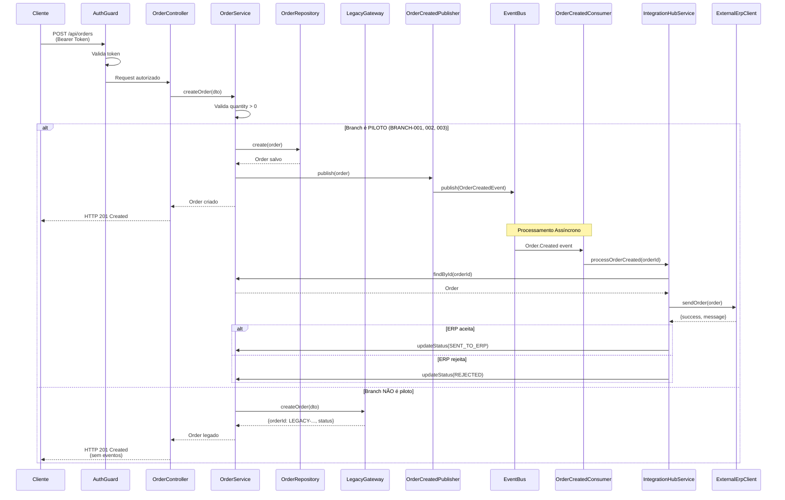
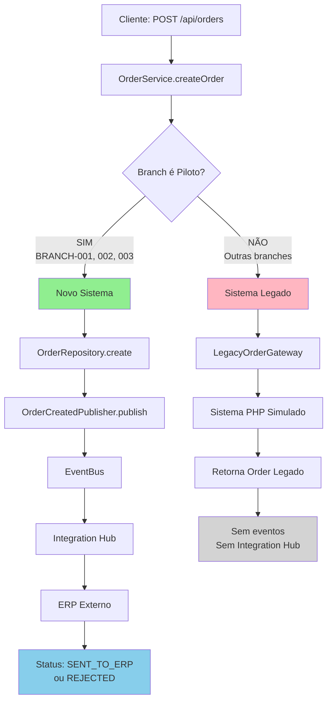
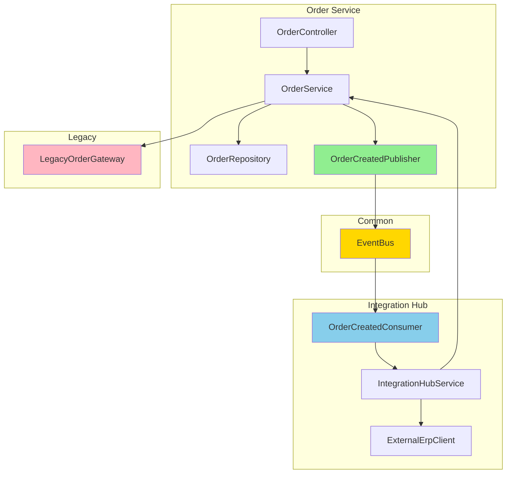
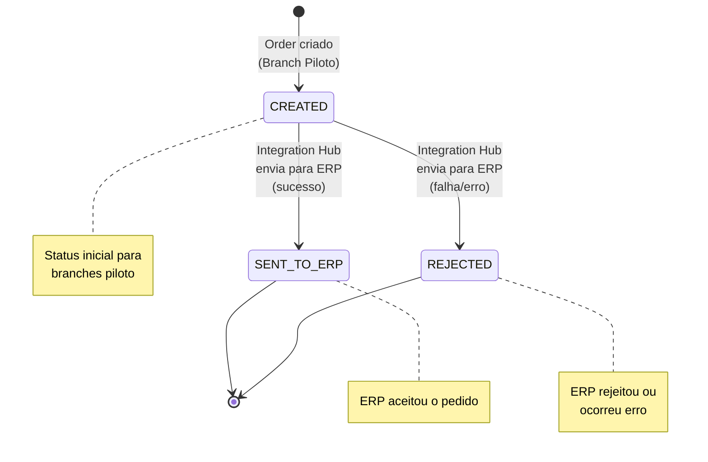

# Teste Técnico - Tech Lead Fullstack

Sistema fullstack para gestão de pedidos de insumos, implementando arquitetura moderna com NestJS (backend) e Next.js (frontend), utilizando Strangler Pattern para migração gradual do sistema legado.

## 📋 Pré-requisitos

- **Node.js** v24.11.1 (especificado em `.nvmrc`)
- **npm** >= 9.x (ou yarn/pnpm)
- **Git**
- **nvm** (Node Version Manager) - recomendado

### Usando nvm (Recomendado)

Este projeto utiliza arquivos `.nvmrc` para garantir a versão correta do Node.js (v24.11.1):

```bash
# Instalar e usar a versão do Node especificada no .nvmrc
cd backend
nvm use

cd ../frontend
nvm use
```

**Nota:** Se você não tem nvm instalado, instale Node.js v24.11.1 diretamente. Os arquivos `.nvmrc` estão presentes em `backend/` e `frontend/` para referência.

## 🚀 Instalação

### 1. Clone o repositório

```bash
git clone git@github.com:DiegoTeles/event-bus-erp.git
```

### 2. Configure a versão do Node.js (se usar nvm)

```bash
cd backend
nvm use  # Usa a versão especificada em .nvmrc (v24.11.1)
cd ../frontend
nvm use  # Usa a versão especificada em .nvmrc (v24.11.1)
cd ..
```

### 3. Instale as dependências do Backend

```bash
cd backend
npm install
cd ..
```

### 4. Instale as dependências do Frontend

```bash
cd frontend
npm install
cd ..
```

## ⚙️ Configuração

### Versão do Node.js

O projeto utiliza **Node.js v24.11.1**. Arquivos `.nvmrc` estão presentes em:

- `backend/.nvmrc`
- `frontend/.nvmrc`

Se estiver usando **nvm**, execute `nvm use` em cada diretório para usar a versão correta automaticamente.

### Backend

Não requer configuração adicional. O backend roda na porta `3000` por padrão.

### Frontend

Crie um arquivo `.env.local` na raiz do projeto `frontend/`:

```env
NEXT_PUBLIC_API_URL=http://localhost:3000
```

## ▶️ Como Rodar

### Backend (NestJS)

```bash
cd backend
npm run start:dev
```

O backend estará disponível em: **http://localhost:3000**

**Scripts disponíveis:**

- `npm run start:dev` - Modo desenvolvimento (watch mode)
- `npm run start` - Modo produção
- `npm run build` - Build para produção
- `npm run lint` - Executar linter

### Frontend (Next.js)

Em um terminal separado:

```bash
cd frontend
npm run dev
```

O frontend estará disponível em: **http://localhost:3001**

**Scripts disponíveis:**

- `npm run dev` - Modo desenvolvimento
- `npm run build` - Build para produção
- `npm run start` - Modo produção (após build)
- `npm run lint` - Executar linter

## 📚 Documentação Swagger

Após iniciar o backend, acesse a documentação interativa da API:

**URL:** http://localhost:3000/api/docs

**Funcionalidades:**

- Descrição completa de todos os endpoints
- Schemas de request/response
- Exemplos de uso
- Teste interativo dos endpoints
- Autenticação Bearer Token

**Como testar no Swagger:**

1. Acesse http://localhost:3000/api/docs
2. Clique em "Authorize" (canto superior direito)
3. Use um token no formato: `fake-token-username-1234567890-abc123`
4. Teste os endpoints diretamente na interface

## 🧪 Testes

### Backend

```bash
cd backend
npm test
```

**Com cobertura:**

```bash
npm run test:cov
```

**Modo watch:**

```bash
npm run test:watch
```

**Testes implementados (Backend - 17 testes):**

- `order.service.spec.ts`: Criação, validação, roteamento Strangler Pattern
- `order.controller.spec.ts`: Endpoints REST
- `integration-hub.service.spec.ts`: Processamento de eventos
- `auth.guard.spec.ts`: Validação de token

### Frontend

```bash
cd frontend
npm test
```

**Com cobertura:**

```bash
npm run test:coverage
```

**Modo watch:**

```bash
npm run test:watch
```

**Testes implementados (Frontend - 37 testes):**

- **Componentes UI:**

  - `Button.test.tsx`: 6 testes
  - `StatusBadge.test.tsx`: 3 testes
- **Componentes de Formulário:**

  - `LoginForm.test.tsx`: 5 testes
  - `OrderForm.test.tsx`: 6 testes
- **Componentes de Orders:**

  - `OrderList.test.tsx`: 3 testes
  - `OrderItem.test.tsx`: 3 testes
- **Contextos:**

  - `AuthContext.test.tsx`: 4 testes
- **Serviços:**

  - `api.test.ts`: 5 testes
- **Páginas:**

  - `LoginPage.test.tsx`: 2 testes

**Total: 54 testes (17 backend + 37 frontend)**

## 🎯 Funcionalidades Implementadas

### Frontend

- ✅ Tela de Login (autenticação simplificada)
- ✅ Tela de criação de Order (formulário com validação)
- ✅ Tela de listagem de Orders (com filtros e status)
- ✅ Proteção de rotas (redireciona para login se não autenticado)
- ✅ Integração com backend via axios
- ✅ Gerenciamento de token (localStorage)
- ✅ Autocomplete de branches (piloto/legado)
- ✅ Notificações toast (react-toastify)
- ✅ Layout responsivo com scroll

### Backend

- ✅ REST API para gestão de Orders
- ✅ Autenticação com Bearer Token
- ✅ Strangler Pattern (roteamento piloto/legado)
- ✅ Event-driven architecture (Event Bus in-memory)
- ✅ Integration Hub para integração com ERP
- ✅ Swagger documentation
- ✅ Validação de entrada (DTOs)
- ✅ Testes unitários

## 🛠️ Tecnologias

### Backend

- NestJS 11
- TypeScript
- Swagger/OpenAPI
- Jest (testes)

### Frontend

- Next.js 16 (App Router)
- React 19
- Styled Components (CSS-in-JS)
- Axios (cliente HTTP)
- React Toastify (notificações)
- Jest + React Testing Library (testes)

**Estrutura do Frontend:**

```
frontend/
├── app/                    # Páginas Next.js (App Router)
│   ├── login/             # Tela de login
│   ├── orders/            # Tela de gestão de orders
│   ├── layout.tsx         # Layout raiz com AuthProvider e StyledComponentsRegistry
│   └── globals.css        # Estilos globais
├── src/
│   ├── components/        # Componentes reutilizáveis
│   │   ├── ui/           # Componentes base (Button, Input, Card, etc.)
│   │   ├── forms/        # Formulários (LoginForm, OrderForm)
│   │   ├── orders/       # Componentes de orders (OrderList, OrderItem)
│   │   ├── layout/       # Componentes de layout (Container, Header, Loading)
│   │   └── ProtectedRoute.tsx
│   ├── contexts/          # Contexts React
│   │   └── AuthContext.tsx
│   ├── services/          # Serviços de API
│   │   └── api.ts
│   └── lib/              # Utilitários
│       └── registry.tsx  # Styled Components Registry (SSR)
└── public/                # Arquivos estáticos
```

**Funcionalidades detalhadas:**

1. **Autenticação:**

   - Login simplificado (apenas username)
   - Token armazenado no localStorage
   - Proteção de rotas automática
   - Redirecionamento para login se não autenticado
2. **Criação de Pedidos:**

   - Formulário com validação
   - Seleção de branch com autocomplete (piloto ou legado)
   - Validação de quantidade > 0
   - Feedback visual via toast (sucesso/erro)
   - Limpeza automática de campos após sucesso
3. **Listagem de Pedidos:**

   - Lista todos os pedidos criados
   - Exibe status (CREATED, SENT_TO_ERP, REJECTED)
   - Mostra detalhes: branchId, itemId, quantity, data
   - Atualização automática após criar novo pedido
   - Scroll infinito na lista

## Visão Geral da Arquitetura

### Arquitetura em Camadas Modulares com Event-Driven

A solução implementa uma arquitetura em camadas com separação clara de responsabilidades, utilizando módulos NestJS e um event bus in-memory para comunicação assíncrona entre serviços.

**Componentes principais:**

1. **Order Service**: Responsável pela criação e gestão de pedidos (Orders)
2. **Integration Hub**: Processa eventos de Orders e integra com sistemas externos (ERP)
3. **Auth Module**: Validação simplificada de tokens para autenticação
4. **Common**: Código compartilhado (event bus, guards, interfaces)

**Fluxo de dados:**

1. Cliente faz POST `/api/orders` → OrderController
2. OrderController → OrderService (valida e cria order)
3. OrderService verifica se branch é piloto (Strangler Pattern)
4. Se piloto: persiste order no novo sistema e publica evento `Order.Created`
5. Se não piloto: processa no sistema legado e retorna sucesso
6. Integration Hub consome evento (apenas para branches piloto) e envia para ERP (fake)
7. Status do order é atualizado conforme resposta do ERP (apenas branches piloto)

## Diagramas de Fluxo (Mermaid)

### Fluxo Completo - Criação de Order



### Strangler Pattern - Roteamento de Branches



### Arquitetura Event-Driven



### Fluxo de Estados do Order



## Diagrama C4

### Contexto (C4 Level 1)

**Atores:**

- Usuário Interno: Colaborador que cria e consulta pedidos
- ERP Externo: Sistema externo que recebe pedidos

**Sistemas:**

- Auth Portal: Autenticação e autorização
- Order Service: Gestão de pedidos
- Integration Hub: Integração com sistemas externos
- Monólito Legado: Sistema antigo (PHP + MySQL)

### Containers (C4 Level 2)

1. **Auth Service (Backend)**

   - Valida tokens de autenticação
   - Implementação simplificada (token fake)
2. **Frontend Portal (Next.js)**

   - Interface web para usuários
   - Autenticação e gestão de sessão
   - Criação e listagem de orders
   - Integração com backend via REST API
3. **Order Service (NestJS)**

   - REST API para criação/consulta de orders
   - Lógica de negócio e validações
   - Persistência in-memory
4. **Integration Hub (NestJS)**

   - Consome eventos de Order
   - Integra com ERP externo (fake)
   - Atualiza status dos orders
5. **Monólito Legado**

   - Sistema antigo (simulado via LegacyOrderGateway)
   - Recebe orders de branches não migradas
6. **Event Bus (In-Memory)**

   - Pub/Sub para eventos de domínio
   - Comunicação assíncrona entre serviços

**Comunicação:**

- **Síncrona (REST)**: Cliente ↔ Order Service, Order Service ↔ Legacy Gateway
- **Assíncrona (Eventos)**: Order Service → Event Bus → Integration Hub

**Strangler Pattern:**

- Branches piloto (`BRANCH-001`, `BRANCH-002`, `BRANCH-003`) usam novo Order Service
- Outras branches são roteadas para monólito legado via LegacyOrderGateway

## ADRs (Architecture Decision Records)

Documentação das principais decisões arquiteturais do projeto.

---

### ADR 1: Stack Backend - NestJS

**Decisão:** Usar NestJS com arquitetura em camadas (Controller → Service → Repository)

**Por quê?**

- Estrutura padronizada: todos os módulos seguem o mesmo padrão
- Testabilidade: injeção de dependência facilita testes
- TypeScript: type safety reduz bugs
- Swagger integrado: documentação automática da API

**Alternativas descartadas:**

- **Express.js**: Muito boilerplate manual, difícil manter consistência
- **Fastify**: Ecossistema menor, menos recursos built-in

**Consequências:**

- ✅ Código organizado e testável
- ⚠️ Curva de aprendizado inicial para equipe

---

### ADR 2: Comunicação entre Serviços - Event-Driven

**Decisão:** Order Service publica eventos, Integration Hub consome e integra com ERP

**Por quê?**

- Baixo acoplamento: Order Service não conhece ERP
- Assíncrono: criação de order não espera resposta do ERP
- Extensível: fácil adicionar novos consumers (notificações, analytics)
- Separação de responsabilidades: Order Service = negócio, Integration Hub = integrações

**Fluxo:**

```
OrderService → Publisher → EventBus → Consumer → IntegrationHub → ERP
```

**Alternativas descartadas:**

- **REST direto**: Alto acoplamento, bloqueia criação se ERP estiver lento
- **Kafka/RabbitMQ**: Infraestrutura complexa, overkill para teste técnico

**Consequências:**

- ✅ Processamento assíncrono não bloqueia criação de orders
- ⚠️ Event bus in-memory não persiste eventos (aceitável para teste)

**Nota:** Event bus in-memory pode ser migrado para Kafka no futuro sem mudar código.

---

### ADR 3: Migração - Strangler Pattern

**Decisão:** Migração gradual por branch usando roteamento baseado em `branchId`

**Por quê?**

- Segurança: migração gradual reduz risco
- Rollback fácil: remover branch da lista piloto
- Validação real: testa em produção com tráfego real
- Transparência: cliente não percebe diferença

**Como funciona:**

```typescript
if (branchId é piloto: BRANCH-001, 002, 003) {
  // Novo sistema → salva → publica evento
} else {
  // Sistema legado → processa no PHP
}
```

**Alternativas descartadas:**

- **Big Bang**: Muito arriscado, tudo pode quebrar de uma vez
- **Dual Write**: Complexidade desnecessária

**Consequências:**

- ✅ Migração segura e controlada
- ⚠️ Código de roteamento adicional (removido após migração completa)

**Plano:** Expandir gradualmente adicionando mais branches à lista piloto.

## Estrutura do Projeto

### Backend

```
src/
├── common/                    # Código compartilhado
│   ├── events/               # Event bus in-memory
│   ├── guards/                # Auth guards
│   ├── decorators/            # Swagger decorators
│   └── interfaces/            # Contratos/interfaces
├── order/                     # Order Service Module
│   ├── dto/                   # DTOs de entrada/saída
│   ├── entities/              # Entidades de domínio
│   ├── events/                # Eventos de domínio
│   ├── publishers/            # Event publishers
│   ├── controllers/           # REST endpoints
│   ├── services/              # Lógica de negócio
│   ├── repositories/          # Persistência
│   ├── gateways/              # LegacyOrderGateway (Strangler)
│   └── order.module.ts
├── integration-hub/           # Integration Hub Module
│   ├── consumers/            # Event consumers
│   ├── clients/               # ExternalErpClient (fake)
│   ├── services/              # Lógica de integração
│   └── integration-hub.module.ts
├── auth/                      # Auth Module
│   ├── controllers/           # Endpoints de autenticação
│   ├── services/              # Validação de token
│   └── auth.module.ts
└── app.module.ts
```

### Frontend

```
frontend/
├── app/                       # Páginas Next.js (App Router)
│   ├── login/                 # Tela de login
│   ├── orders/                # Tela de gestão de orders
│   ├── layout.tsx             # Layout raiz
│   └── globals.css            # Estilos globais
├── src/
│   ├── components/            # Componentes reutilizáveis
│   │   ├── ui/                # Componentes base
│   │   │   ├── Button/
│   │   │   ├── Input/
│   │   │   ├── Card/
│   │   │   ├── StatusBadge/
│   │   │   ├── BranchSelect/
│   │   │   └── Message/
│   │   ├── forms/             # Formulários
│   │   │   ├── LoginForm/
│   │   │   ├── OrderForm/
│   │   │   └── FormField/
│   │   ├── orders/            # Componentes de orders
│   │   │   ├── OrderList/
│   │   │   └── OrderItem/
│   │   ├── layout/            # Componentes de layout
│   │   │   ├── Container/
│   │   │   ├── Header/
│   │   │   ├── Loading/
│   │   │   └── LoginContainer/
│   │   └── ProtectedRoute/
│   ├── contexts/              # Contexts React
│   │   └── AuthContext.tsx
│   ├── services/              # Serviços de API
│   │   └── api.ts
│   └── lib/                   # Utilitários
│       └── registry.tsx        # Styled Components Registry
└── public/                     # Arquivos estáticos
```

## Endpoints da API

### POST `/api/orders`

Cria um novo pedido.

**Headers:**

```

Authorization: Bearer `<token>`

```

**Body:**

```json
{
  "branchId": "BRANCH-001",
  "itemId": "ITEM-001",
  "quantity": 10
}
```

**Resposta (201):**

```json
{
  "orderId": "ORDER-1234567890-abc123",
  "branchId": "BRANCH-001",
  "itemId": "ITEM-001",
  "quantity": 10,
  "status": "CREATED",
  "createdAt": "2025-01-XX...",
  "updatedAt": "2025-01-XX..."
}
```

### GET `/api/orders/:id`

Obtém detalhes de um pedido específico.

**Headers:**

```
Authorization: Bearer <token>
```

**Resposta (200):**

```json
{
  "orderId": "ORDER-123",
  "branchId": "BRANCH-001",
  "itemId": "ITEM-001",
  "quantity": 10,
  "status": "SENT_TO_ERP",
  "createdAt": "2025-01-XX...",
  "updatedAt": "2025-01-XX..."
}
```

### GET `/api/orders?branchId=BRANCH-001`

Lista pedidos (opcionalmente filtrado por branchId).

**Headers:**

```
Authorization: Bearer <token>
```

**Resposta (200):**

```json
[
  {
    "orderId": "ORDER-123",
    "branchId": "BRANCH-001",
    "itemId": "ITEM-001",
    "quantity": 10,
    "status": "SENT_TO_ERP",
    "createdAt": "2025-01-XX...",
    "updatedAt": "2025-01-XX..."
  }
]
```

## Integração Frontend-Backend

O frontend se comunica com o backend através do serviço `api.ts`:

- **Autenticação**: `POST /api/auth/login`
- **Criar Order**: `POST /api/orders`
- **Listar Orders**: `GET /api/orders`
- **Buscar Order**: `GET /api/orders/:id`

Todas as requisições incluem automaticamente o token de autenticação no header `Authorization: Bearer <token>`.

O frontend também implementa:

- Interceptor de requisições para adicionar token
- Interceptor de respostas para tratar erros 401 (redireciona para login)
- Gerenciamento de estado de autenticação via Context API

## Uso de IA

A IA foi utilizada para:

- Criação da documentação do swagger
- Revisão dos diagramas do Mermaid
- Revisão de documentação (README)
- Revisão dos testes unitários
- Verificação de padrões de clean architecture no front

## Papel de Fullstack Tech Lead

### Organização da Squad

**Auth Portal (Front + Back):**

- 1 Backend Developer (NestJS)
- 1 Frontend Developer (Next.js)
- 1 QA (testes E2E)

**Integration Hub:**

- 1 Backend Developer (NestJS, integrações)
- 1 DevOps (monitoramento, alertas)

**Order Service:**

- 2 Backend Developers (NestJS, domínio)
- 1 QA (testes unitários e integração)

**Estratégia de revisão:**

- PRs obrigatórios com pelo menos 1 aprovação
- Branches: `main`, `develop`, `feature/*`, `hotfix/*`
- Padrões mínimos: testes unitários, lint passando, documentação atualizada

**Padrões de arquitetura (Golden Policies):**

- Todos os serviços seguem arquitetura em camadas (Controller → Service → Repository)
- Eventos de domínio para comunicação assíncrona
- Integration Hub centraliza integrações externas
- Auth obrigatório em todas as rotas públicas

**Dívidas técnicas durante migração:**

- **Aceitável**:

  - Event bus in-memory (migrar para Kafka, Rabbit ou PubSub em 3 meses)
  - Persistência in-memory (migrar para PostgreSQL em 2 meses)
  - Monitoramento básico (apenas logs, migrar para Prometheus/Grafana em 2 meses)
- **Implementado:**

  - ✅ Testes unitários backend (17 testes passando)
  - ✅ Testes unitários frontend (37 testes passando)
  - ✅ Validação de entrada (DTOs com class-validator)
  - ✅ Tratamento de erros básico (BadRequestException, UnauthorizedException)
  - ✅ Styled Components com SSR (registry para evitar FOUC)
- **Bloqueante para produção**:

  - Monitoramento avançado (métricas, alertas, dashboards)
  - Tratamento de erros mais robusto (retry, circuit breaker)
  - Logging estruturado (JSON logs, níveis apropriados)
